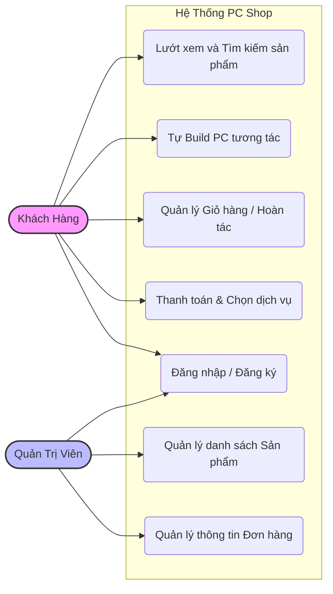
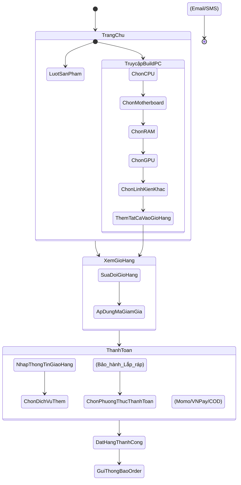

# Báo Cáo Chi Tiết Dự Án: PC Shop & Hệ Thống Tự Build PC

Dự án này là một trang web Thương Mại Điện Tử chuyên bán linh kiện PC và hệ thống hỗ trợ lắp ráp (Build PC). Dự án được triển khai bằng framework **ASP.NET MVC (.NET 9.0)** kết hợp **Entity Framework Core (SQLite)**, đồng thời áp dụng chuẩn kiến trúc phần mềm và **10 Mẫu Thiết Kế (Design Patterns)** trong C# để đảm bảo tính mở rộng, dễ duy trì và bám sát tài liệu System Design.

---

## 1. Biểu đồ Use Case (Use Case Diagram)
Biểu đồ này thể hiện các nhóm người dùng (Actor) và các tính năng chính (Use Cases) của hệ thống PC Shop.



**Mô tả các Use Case chính:**
- **Lướt xem sản phẩm:** Khách hàng duyệt các linh kiện rời (CPU, RAM, GPU, v.v.).
- **Tự Build PC:** Giao diện Interactive (tương tự KCCShop) hỗ trợ khách hàng chọn từng linh kiện theo danh mục để hợp thành bộ PC hoàn chỉnh.
- **Quản lý giỏ hàng:** Thêm, xóa linh kiện và đặc biệt hỗ trợ Hoàn Tác (Undo) thông qua Command Pattern.
- **Thanh toán:** Checkout với sự lựa chọn đa dạng về chiến lược giá (Strategy), phương thức thanh toán (Adapter) và các dịch vụ cộng thêm (Decorator).

---

## 2. Biểu đồ Hoạt động (Activity Diagram)
Biểu đồ mô tả luồng nghiệp vụ tiêu biểu nhất: **Khách hàng tự Build PC và thanh toán**.



---

## 3. Biểu đồ Lớp (Class Diagram) & Tổng Quan Design Patterns
Biểu đồ minh họa sự liên kết cốt lõi giữa các Class đại diện cho các Design Patterns trong hệ thống.

```mermaid
classDiagram
    class AppDbContext {
        <<Singleton>>
        - static DbContext _instance
        + GetInstance() dbContext
    }
    
    class IProductFactory {
        <<Factory Method>>
        + CreateProduct(CategoryType) Product
    }
    
    class IPCBuildFactory {
        <<Abstract Factory>>
        + CreateCPU()
        + CreateMotherboard()
    }
    
    class IPCBuilder {
        <<Builder>>
        + SetCPU()
        + SetGPU()
        + GetResult() PCBuild
    }
    
    class IPricingStrategy {
        <<Strategy>>
        + CalculatePrice(decimal basePrice) decimal
    }
    
    class IOrderObserver {
        <<Observer>>
        + Update(Order order)
    }
    
    class IProductService {
        <<Decorator>>
        + GetPrice() decimal
    }
    
    class IPaymentProcessor {
        <<Adapter>>
        + ProcessPayment(decimal) bool
    }
    
    class IRepository~T~ {
        <<Repository>>
        + GetByIdAsync(id) T
        + AddAsync(T entity)
    }
    
    class ICartCommand {
        <<Command>>
        + Execute()
        + Undo()
    }

    IProductFactory ..> Product : Creates
    IPCBuilder ..> PCBuild : Assembles
    IPricingStrategy <|-- RegularPricing
    IProductService <|-- WarrantyDecorator
    IPaymentProcessor <|-- MoMoAdapter
```



---

## 4. Giải thích Source Code & 10 Design Patterns Áp Dụng

Mã nguồn được sắp xếp theo thư mục `DesignPatterns/` trong ứng dụng để tuân thủ 10 mẫu thiết kế theo tài liệu.

### 4.1. Nhóm Creational Patterns (Khởi tạo đối tượng)

1. **Singleton Pattern ([DesignPatterns/Singleton/ConfigurationManager.cs](file:///C:/Users/rustd/OneDrive/M%C3%A1y%20t%C3%ADnh/demo/PCShop/DesignPatterns/Singleton/ConfigurationManager.cs))**
   - **Mục đích:** Đảm bảo toàn bộ ứng dụng chỉ có duy nhất một Instance quản lý các tham số thiết lập chung (như % thuế, phí vận chuyển).
   - **Tác dụng:** Tránh việc đọc file config/DB nhiều lần, đồng thời chia sẻ cấu hình Global nhất quán cho mọi class.

2. **Factory Method ([DesignPatterns/FactoryMethod/ProductFactory.cs](file:///C:/Users/rustd/OneDrive/M%C3%A1y%20t%C3%ADnh/demo/PCShop/DesignPatterns/FactoryMethod/ProductFactory.cs))**
   - **Mục đích:** Giao việc khởi tạo các đối tượng sản phẩm (CPU, RAM, GPU...) cho lớp Factory tuỳ theo `CategoryType`.
   - **Tác dụng:** Giúp controller/service không cần sử dụng từ khóa `new` trực tiếp với từng loại linh kiện cụ thể, dễ dàng scale thêm danh mục mới.

3. **Abstract Factory (`DesignPatterns/AbstractFactory/...`)**
   - **Mục đích:** Khởi tạo các combo linh kiện (Families of objects) đảm bảo tính tương thích với nhau (Ví dụ: [IntelBuildFactory](file:///C:/Users/rustd/OneDrive/M%C3%A1y%20t%C3%ADnh/demo/PCShop/DesignPatterns/AbstractFactory/IntelBuildFactory.cs#9-52) chuyên xuất combo Main/CPU Intel, [AmdBuildFactory](file:///C:/Users/rustd/OneDrive/M%C3%A1y%20t%C3%ADnh/demo/PCShop/DesignPatterns/AbstractFactory/AmdBuildFactory.cs#9-52) xuất combo AMD).
   - **Tác dụng:** Giúp các gói build đề xuất tự động (Pre-built PC) luôn đồng bộ hệ sinh thái.

4. **Builder (`DesignPatterns/Builder/...`)**
   - **Mục đích:** Xây dựng một đối tượng PC phức tạp qua từng bước độc lập (set CPU, set RAM...). Có quản lý qua lớp [PCDirector](file:///C:/Users/rustd/OneDrive/M%C3%A1y%20t%C3%ADnh/demo/PCShop/DesignPatterns/Builder/PCDirector.cs#15-19).
   - **Tác dụng:** Hỗ trợ trực tiếp cho tính năng Tự Build PC, giúp người dùng "lắp ráp" PC dần dần mà không cần có mọi linh kiện ngay từ đầu.

### 4.2. Nhóm Structural Patterns (Cấu trúc đối tượng)

5. **Decorator (`DesignPatterns/Decorator/...`)**
   - **Mục đích:** Thêm các "tính năng mở rộng" linh hoạt vào đối tượng sản phẩm cơ bản tại thời điểm runtime thay vì dùng kế thừa tĩnh.
   - **Tác dụng:** Dùng trong tính năng **Dịch vụ bổ sung** (Base price + Phí bảo hành mở rộng [WarrantyDecorator](file:///C:/Users/rustd/OneDrive/M%C3%A1y%20t%C3%ADnh/demo/PCShop/DesignPatterns/Decorator/ConcreteDecorators.cs#11-14) + Phí lắp ráp `AssemblyDecorator`).

6. **Repository (`DesignPatterns/Repository/...`)**
   - **Mục đích:** Trừu tượng hoá toàn bộ lớp truy cập cơ sở dữ liệu Entity Framework Core.
   - **Tác dụng:** Logic kinh doanh trong ứng dụng tương tác qua giao diện [IRepository](file:///C:/Users/rustd/OneDrive/M%C3%A1y%20t%C3%ADnh/demo/PCShop/DesignPatterns/Repository/IRepository.cs#13-23), không phụ thuộc hay "dính chặt" vào EF Core. Rất tốt cho việc kiểm thử Unit Testing.

7. **Adapter (`DesignPatterns/Adapter/...`)**
   - **Mục đích:** Wrap (bao bọc) các API thanh toán bên thứ ba không tương thích về dưới dạng một giao diện chung.
   - **Tác dụng:** Các cổng thanh toán (Ví MoMo, VNPay) có API rất khác nhau, pattern này đóng gói chúng dưới chuẩn `IPaymentProcessor.ProcessPayment()`.

### 4.3. Nhóm Behavioral Patterns (Hành vi & Tương tác)

8. **Strategy (`DesignPatterns/Strategy/...`)**
   - **Mục đích:** Tách rời thuật toán tính giá thành các lớp chiến lược riêng biệt. 
   - **Tác dụng:** Hệ thống linh hoạt thay đổi cách tính tiền đơn hàng lúc Checkout như: Giữ nguyên ([RegularPricing](file:///C:/Users/rustd/OneDrive/M%C3%A1y%20t%C3%ADnh/demo/PCShop/DesignPatterns/Strategy/ConcretePricingStrategies.cs#6-15)), Trừ % Khuyến mãi ([DiscountPricing](file:///C:/Users/rustd/OneDrive/M%C3%A1y%20t%C3%ADnh/demo/PCShop/DesignPatterns/Strategy/ConcretePricingStrategies.cs#19-28)), Giảm sâu + Freeship ([VipPricing](file:///C:/Users/rustd/OneDrive/M%C3%A1y%20t%C3%ADnh/demo/PCShop/DesignPatterns/Strategy/ConcretePricingStrategies.cs#32-41)).

9. **Observer (`DesignPatterns/Observer/...`)**
   - **Mục đích:** Cung cấp cơ chế Subscribe / Publish. Khi trạng thái đơn hàng thay đổi, sẽ tự động thông báo tới các phần khác.
   - **Tác dụng:** Sử dụng trong [OrderService](file:///C:/Users/rustd/OneDrive/M%C3%A1y%20t%C3%ADnh/demo/PCShop/DesignPatterns/Decorator/IOrderService.cs#9-14). Khi Client đặt hàng thành công, hệ thống thông qua [OrderSubject](file:///C:/Users/rustd/OneDrive/M%C3%A1y%20t%C3%ADnh/demo/PCShop/DesignPatterns/Observer/IOrderObserver.cs#16-22) kích hoạt một loạt các thông báo: Gửi Email cho khách ([EmailNotification](file:///C:/Users/rustd/OneDrive/M%C3%A1y%20t%C3%ADnh/demo/PCShop/DesignPatterns/Observer/OrderObservers.cs#40-49)), gửi SMS ([SmsNotification](file:///C:/Users/rustd/OneDrive/M%C3%A1y%20t%C3%ADnh/demo/PCShop/DesignPatterns/Observer/OrderObservers.cs#53-65)).

10. **Command (`DesignPatterns/Command/...`)**
    - **Mục đích:** Biến các yêu cầu tương tác thành các Object cụ thể có hàm [Execute()](file:///C:/Users/rustd/OneDrive/M%C3%A1y%20t%C3%ADnh/demo/PCShop/DesignPatterns/Command/CartCommands.cs#27-48) và [Undo()](file:///C:/Users/rustd/OneDrive/M%C3%A1y%20t%C3%ADnh/demo/PCShop/Controllers/CartController.cs#69-76).
    - **Tác dụng:** Ứng dụng xuất sắc vào việc "Quản lý giỏ hàng". Khách thêm đồ ([AddToCartCommand](file:///C:/Users/rustd/OneDrive/M%C3%A1y%20t%C3%ADnh/demo/PCShop/DesignPatterns/Command/CartCommands.cs#20-26)) hoặc lỡ tay gỡ đồ có thể thực hiện hàm [UndoLastAction()](file:///c:/Users/rustd/OneDrive/M%C3%A1y%20t%C3%ADnh/demo/PCShop/Services/CartService.cs#36-40) để khôi phục trực tiếp.

---

## 5. Cấu Trúc Controllers & Views Chính (MVC)

| Controller | Chức Năng | Điểm Nhấn Kiến Trúc |
| ---------- | --------- | ------------------- |
| [PCBuilderController](file:///c:/Users/rustd/OneDrive/M%C3%A1y%20t%C3%ADnh/demo/PCShop/Controllers/PCBuilderController.cs#20-33) | Nền tảng luồng nghiệp vụ Interactive Build PC (giống KCCShop). | Gọi AJAX bằng JQuery/Bootstrap Modals để trả về file Razor Partials qua [GetProductsByCategory](file:///c:/Users/rustd/OneDrive/M%C3%A1y%20t%C3%ADnh/demo/PCShop/Controllers/PCBuilderController.cs#45-52). Gửi kết quả dạng Array sang Cart. |
| [CartController](file:///c:/Users/rustd/OneDrive/M%C3%A1y%20t%C3%ADnh/demo/PCShop/Controllers/CartController.cs#12-17) | Giỏ hàng. | Điều khiển [CartService](file:///c:/Users/rustd/OneDrive/M%C3%A1y%20t%C3%ADnh/demo/PCShop/Services/CartService.cs#7-41) sử dụng **Command Pattern** (Undo/Redo thao tác giỏ hàng). |
| [OrderController](file:///C:/Users/rustd/OneDrive/M%C3%A1y%20t%C3%ADnh/demo/PCShop/Controllers/OrderController.cs#13-109) | Checkout, thanh toán. | Ứng dụng mạnh mẽ **Decorator** (dịch vụ), **Strategy** (tính giá) và **Adapter** (payment proxy). |
| [ProductController](file:///C:/Users/rustd/OneDrive/M%C3%A1y%20t%C3%ADnh/demo/PCShop/Controllers/ProductController.cs#7-45) | Duyệt / Render danh mục linh kiện. | Render từ DB qua hệ thống **Repository Pattern**. |

---

## 6. Hướng Dẫn Cài Đặt Và Chạy Dự Án

### 6.1. Yêu Cầu Cấu Hình
- **Hệ điều hành:** Windows, macOS, Linux
- **Framework:** .NET 9.0 SDK
- **Cơ sở dữ liệu:** SQLite (Được cấu hình mặc định trong source code, không cần cài đặt thêm server DB nào khác).

### 6.2. Các Bước Cài Đặt
1. **Mở Application Folder:** Di chuyển vào thư mục dự án `PCShop` thông qua Terminal / PowerShell.
   ```bash
   cd "C:\Users\rustd\OneDrive\Máy tính\demo\PCShop"
   ```

2. **Cài Đặt Các Dependencies:** Thực hiện khôi phục các nuget package.
   ```bash
   dotnet restore
   ```

3. **Build Dự Án:** Kiểm tra quá trình biên dịch (Application Compile).
   ```bash
   dotnet build
   ```

4. **Khởi Chạy Ứng Dụng:** Chạy Web Server tích hợp của ASP.NET.
   ```bash
   dotnet run
   ```

5. **Truy Cập:** Mở trình duyệt web và di chuyển vào địa chỉ:
   - `http://localhost:5135`
   - Hoặc `https://localhost:7203` (Nếu báo lỗi chứng chỉ SSL, có thể bấm "Continue" hoặc tập trung thao tác ở nhánh `http`).

6. **Dữ Liệu Mẫu (Seed Data):** Cơ sở dữ liệu SQLite (`pcshop.db`) sẽ tự động được khởi tạo vào lúc hệ thống chạy lần đầu. Kho dữ liệu bao gồm đầy đủ dữ liệu giả lập cho CPU, RAM, GPU để bạn ngay lập tức có thể thử nghiệm tính năng PC Builder.
